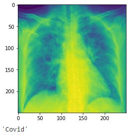
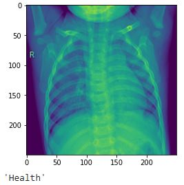
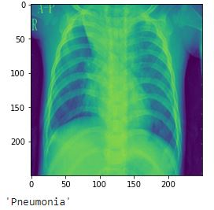
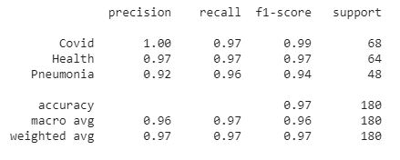
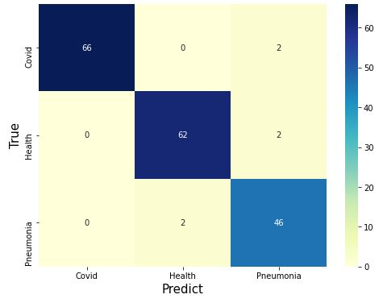

# Covid_Detection
Neural Network for Covid Detection

The intention of this project was to understand and apply all my theorical knowledge in Convolutional Neural Networks but it turn into a competition between my biomedical engineer friend and me. 

The objective was to build a Neural Network for Covid detection using the data from lung tomographies, and the winner will be the model with the best categorical metrics.

I upload my jupyter notebook for this project and here are some images, metrics and plots of my results.

   

Thank you for reading.

Edgar Cardoso

